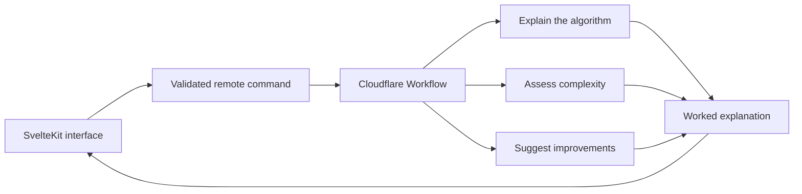

<div align="center">


# AlgoLens

**Turn an algorithm into a clear, worked explanation.**

[Overview](#overview) · [Getting started](#getting-started) · [How it works](#how-it-works) · [Development](#development) · [Deployment](#deployment)

</div>

AlgoLens is a focused learning tool for understanding algorithms. Paste some code, choose its language, and receive a plain-language explanation, a time and space complexity assessment, and practical suggestions for improvement.

## Overview

AlgoLens keeps the path from code to understanding deliberately short:

- Analyse Python, JavaScript, TypeScript, Java, C++, C, Go, and Rust.
- Get an explanation, Big O complexity, and up to four improvement ideas.
- Load built-in examples for a quick first run.
- Resume an in-progress analysis after a connection interruption without starting duplicate AI work.
- Use light or dark mode, keyboard navigation, and `Ctrl+Enter` or `Cmd+Enter` to run an analysis.

The application is built with SvelteKit and Svelte 5, runs on Cloudflare Workers, and uses Cloudflare Workers AI inside a durable Cloudflare Workflow.

> [!IMPORTANT]
> Submitted code is sent to Cloudflare Workers AI. Local full-stack development uses remote AI and therefore requires Cloudflare authentication and consumes your account's Workers AI quota.

## Getting started

AlgoLens is available at [algolens.iktrnch.dev](https://algolens.iktrnch.dev). Open the app, choose a language, and paste an algorithm—or select **Load an example** for a quick first run.

## How it works



Each submission receives an explicit Workflow instance ID. The server subscribes only to terminal Workflow events and returns the typed result when the analysis completes. If the subscription disconnects, AlgoLens reattaches once to that same instance; the browser also stores the pending ID in session storage so a reload can recover the original analysis.

The Workflow runs three Workers AI steps with `@cf/meta/llama-3.3-70b-instruct-fp8-fast`:

1. Explain what the algorithm accomplishes.
2. Assess its time and space complexity.
3. Suggest concise, actionable improvements.

## Project structure

| Path                                  | Purpose                                                |
| ------------------------------------- | ------------------------------------------------------ |
| `src/routes/+page.svelte`             | Input, analysis states, recovery, and result UI        |
| `src/routes/analysis.remote.ts`       | Validated SvelteKit remote commands                    |
| `src/lib/server/analysis.ts`          | Workflow subscription, result validation, and recovery |
| `src/lib/server/workflows/analyse.ts` | Three-step Workers AI analysis Workflow                |
| `src/routes/api/health/+server.ts`    | Binding-independent health endpoint                    |
| `wrangler.jsonc`                      | Development and production Cloudflare bindings         |
| `tests/server.test.mjs`               | Server, subscription, recovery, and Workflow tests     |
| `PRODUCT.md` / `DESIGN.md`            | Product scope and interface design system              |

## Development

### Prerequisites

- [Node.js](https://nodejs.org/) 22.18 or newer
- [Bun](https://bun.sh/)
- A Cloudflare account with access to Workers AI and Workflows

Clone the repository and install its dependencies:

```bash
git clone https://github.com/iktrnch/algolens.git
cd algolens
bun install
```

Authenticate Wrangler, then start the complete application:

```bash
bunx wrangler login
bun run dev
```

The local application is served at <http://localhost:5173>.

> [!NOTE]
> `bun run dev` builds SvelteKit before starting Wrangler so that the Cloudflare bindings and Workflow are available. Use `bun run dev:ui` only for UI work that does not require a live analysis.

| Command          | Description                                           |
| ---------------- | ----------------------------------------------------- |
| `bun run dev`    | Build and run the full app with Wrangler on port 5173 |
| `bun run dev:ui` | Run the SvelteKit UI with Vite only                   |
| `bun run check`  | Run Svelte and TypeScript checks                      |
| `bun run lint`   | Check formatting with Prettier                        |
| `bun run format` | Format the repository with Prettier                   |
| `bun run test`   | Build and run the Node test suite                     |
| `bun run build`  | Create a production Cloudflare build                  |
| `bun run types`  | Regenerate Cloudflare runtime types                   |

Run the standard validation suite before submitting changes:

```bash
bun run check
bun run lint
bun run test
```

The tests mock Workers AI and Workflow instances, so they do not consume AI quota. Run `bun run types` after changing the Wrangler compatibility date, flags, or bindings.

The health endpoint is available at `GET /api/health` and returns:

```json
{ "status": "ok" }
```

## Deployment

Build and deploy the production environment with:

```bash
bun run deploy
```

The SvelteKit adapter generates the Worker entry point, and the Vite configuration appends the named `AlgorithmAnalysisWorkflow` export required by Cloudflare. The production environment binds static assets, Workers AI, and the `algorithm-analysis` Workflow.

> [!WARNING]
> `wrangler.jsonc` contains the repository owner's Cloudflare account and custom-domain configuration. Review the Worker name, `account_id`, route, and environment bindings before deploying from another account.
